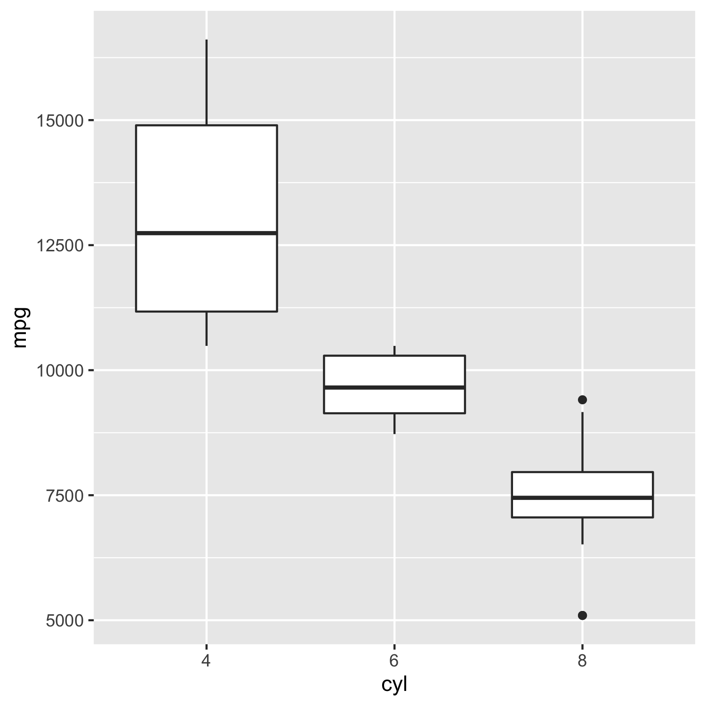

```{r setup, include=FALSE}
library(tidyverse)
library(here)
knitr::opts_chunk$set(echo = FALSE, message = FALSE)
```

# Introduction

# Methods

# Results

## Option I: read in processed data and generate figures

We do have the option of caching this, but it can get overwhelming and too much detail etc.

```{r sleeping-beauty-plot, fig.cap="This takes a while to generate", cache=TRUE}
analysis_data <- read_csv("data/processed/mtcars-subset.csv")

print("sleep for 10 seconds")
Sys.sleep(10)

analysis_data %>% 
  ggplot() +
    geom_point(aes(mpg, disp))
```

Check out Figure \@ref(fig:sleeping-beauty-plot).

## Option II: read in processed data and generate figures

Imagine we just read in the final step before the figure.
This will give use Figure \@ref(fig:quicker-processed-data).

```{r quicker-processed-data, fig.cap="This takes less of a while to generate"}
complex_data <- read_csv("data/processed/complex_data.csv") %>% 
  mutate(cyl = factor(cyl))

complex_data %>% 
  ggplot() +
    geom_boxplot(aes(mpg, cyl))
```

## Option III: read in the pre-generated plots

We could also have all the computations outside of this R Markdown file, but maybe that's less transparent.

Either way, this will give use Figure \@ref(fig:pre-generated-figure)

```{r pre-generated-figure, fig.cap="This is the quickest, but maybe not the most transparent", out.width="100%"}

```

# Conclusion
